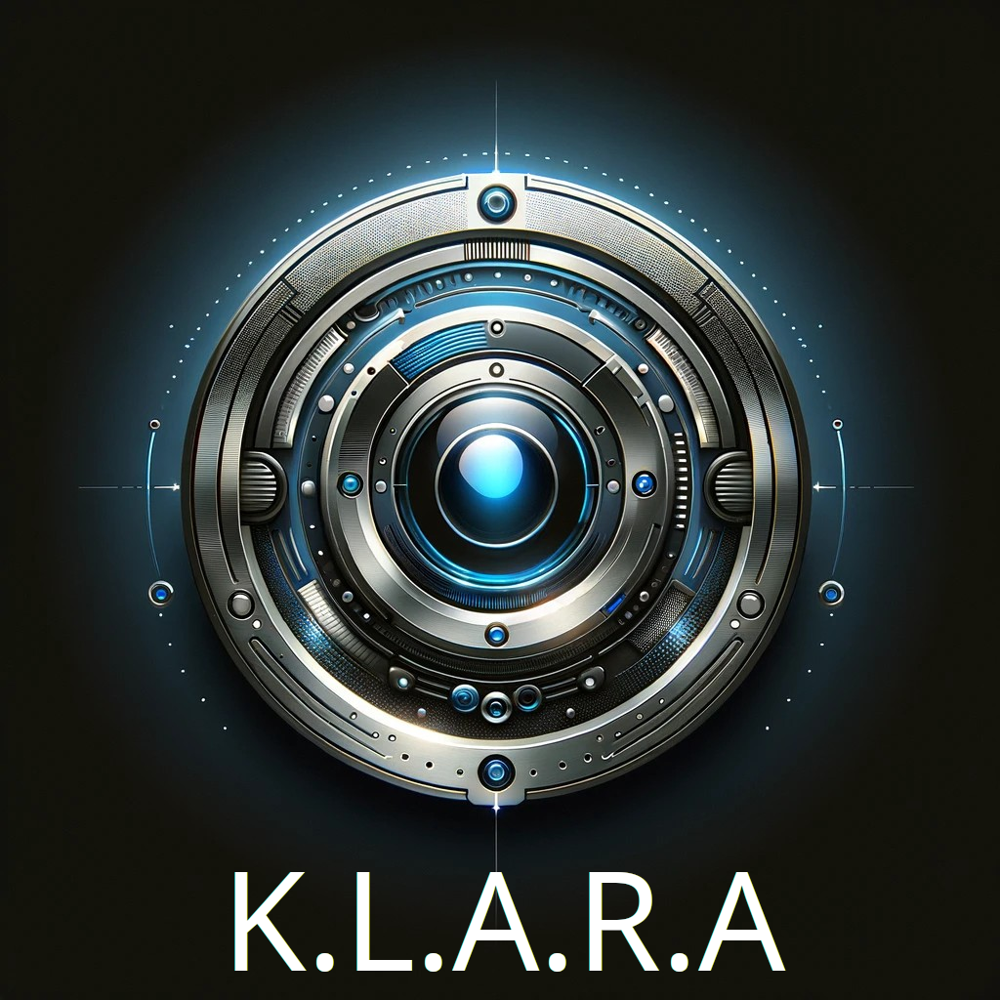

# K.L.A.R.A



 - **K**ubuntu
 - **L**ocal
 - **A**lgorythmic
 - **R**ealtime
 - **A**ssistant

Klara is a desktop AI companion, designed to support you in research, learning and general work. klara is 
designed to provide a voice powered _human-esque_ desktop assistant.

try it:

```make all```

## Dependencies

### Linux

On Ubuntu or Debian, run this command:

```
apt install libasound2-dev portaudio19-dev python3.10-venv
```
# Road Map

 -[ ] Markdown Transcript Logger. _Creates nicely formatted human-readable transcripts_
 -[ ] Clipboard integration. _Enables R/W from clipboard, handy for code snippets_
 -[ ] KDE DBUS IPC Integration. _Step toward desktop integration_
 -[ ] RAG Support for KDE Handbook, and Kubuntu Manual. _Provides Klara with KDE help reference context via Retrieval Augment Generation_
 -[ ] Browser Integration. _Opening stuff on the web_
 -[ ] Skills Plugin. _Enables Specific Skills to be developed, useful for creating Actions / Workflows_
 -[ ] Personas. _Custom prompts, which cause Klara to behave in definable ways_

# Contribute

Licenses are GPLv3 or less restrictive, please do..

# Shoulders
_We stand upon the shoulders of Giants_

### GPT4ALL-Voice-Assistant
https://github.com/Ai-Austin/GPT4ALL-Voice-Assistant

### GPT4ALL
https://github.com/nomic-ai/gpt4all

### HTGO-TTS
https://github.com/hegedustibor/htgo-tts
